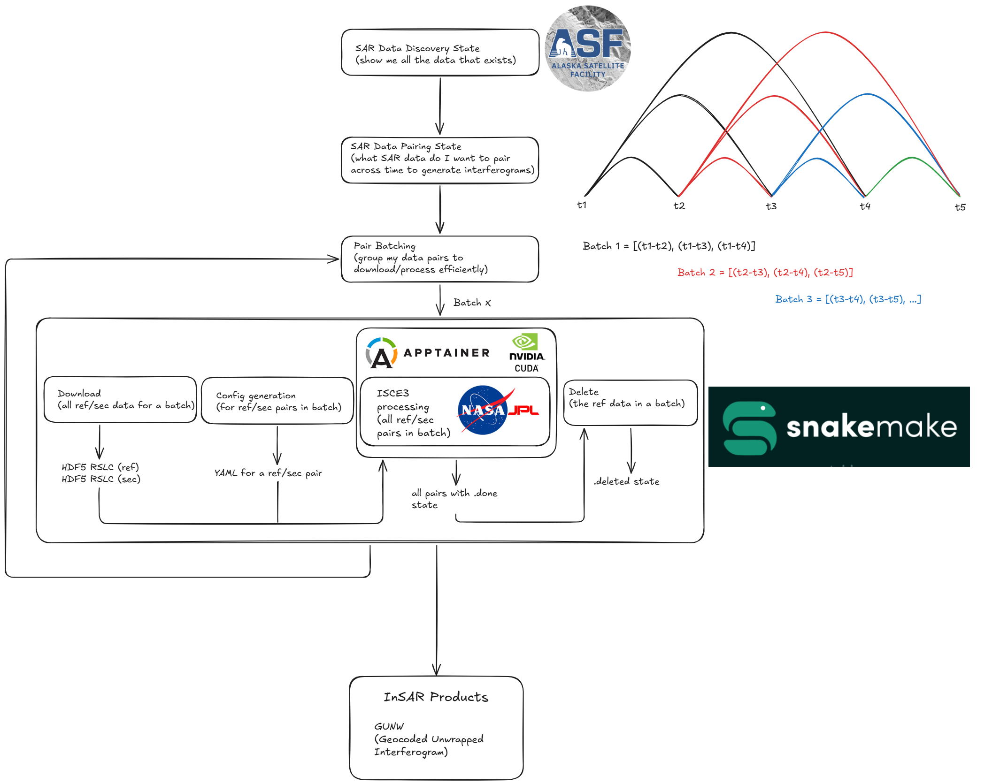

# isce3-builder
An automated NISAR IFG HPC processing workflow with isce3 and Docker/Apptainer/Snakemake.

## HPC (Slurm)

### Apptainer (prereq)

To run on HPC GPU resources you will need an Apptainer image (`.sif`). You can pull one from my docker hub registry:

`apptainer build isce3cuda.sif docker://cburton10/isce3cuda:0.25.7`

### DEM (prereq)

At present, DEM access through isce3/AWS seems broken, use: `./download_COP_dem.sh` to create the Copernicus DEM 30-m referenced to WGS84 ellipsoid (for the NZ North Island).

### Semi-automated processing w/ Snakemake

A WIP (working towards complete automation) but for NISAR track 94 frame 160 you can process all available RSLC frames on ASF to produce 12, 24, and 36 day geocoded unwrapped interferograms (GUNW). The steps are:

- run discovery to create data availability state file: `uv run utils/discovery.py`

- run build_triplets to create RSLC pair state file for all possible 12, 24, and 36 day pairs: `uv run build_triplets.py`

- run the orchestrator which submits RSLC batches to snakemake, I recommend running in the background `nohup uv run nisar_orchestrator.py --pairs-state state_files/nisar_rslc_ifg_pairs_track94_frame160.json --jobs 4 --local-cores 4 > test_snakemake_orchestrator.log 2>&1 &`

All is set up to run on cuda with a Nvidia gpu node (with MIG partitioning).

At present the NISAR track/frame is hardcoded but will be dynamic in the future.

### Process a single RSLC pair (optional)

You can run the container on a GPU node via slurm with `run_isce3_cuda.sl`. I am using a MIG partition so you might have to tweak it for your setup. Make sure you've downloaded the relevant RSLC NISAR data into `inputs/rslc/` and edited the config `configs/insar-cuda-template.yaml` to match.

## Docker

### testing

`sudo docker build --target tester -t isce3:testing . --progress=plain`

DEM stage will fail -> bbox_epsg parameter out of sync between prod code and tests.

### final

`sudo docker build --target final -t isce3:0.25.7 . --progress=plain`

## Docker compose (recommended)

TBA
